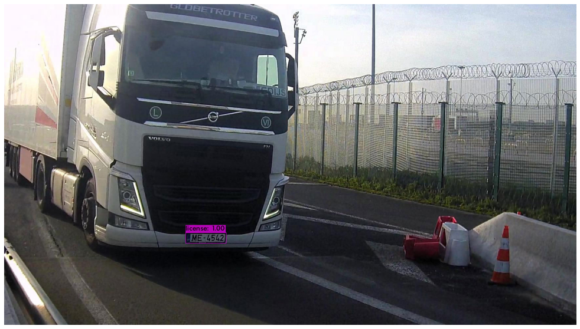
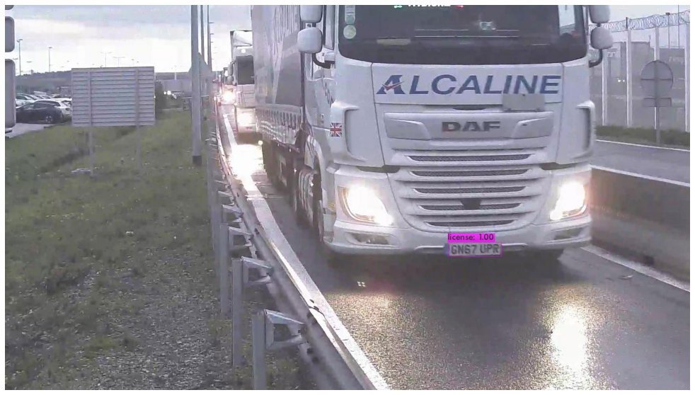

# Licence-Plate-Detection

This repository walks you through how to Implement, Fine-Tune and Run the pre-trained YOLOv4 Object Detections Model with Darknet through Google Colab.In this project, i aim to detect trucks' licence plates. 

## Data

The data is private. I have 18 Videos of Trucks crossing a Channel with a total of 230 min. I managed to get 346 images from the videos and after data augmentation, i got 2159 images. 
I used [Roboflow](https://roboflow.com/) for faster and better augmentation.

### Labeling

I used an annotation tool to manually draw the labels called LabelImg. You can download it from here [LabelImg](https://github.com/tzutalin/labelImg).

## Model

Darknet is an open source neural network framework written in C and CUDA. It is fast, easy to install, and supports CPU and GPU computation. You can find the source on [GitHub](https://github.com/pjreddie/darknet). We will run our detections with Darknet and YOLOv4.

## Results

